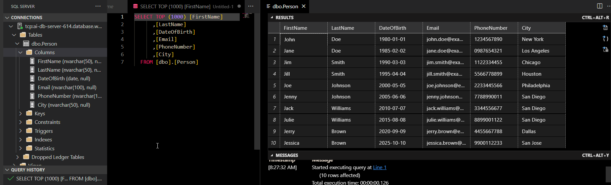
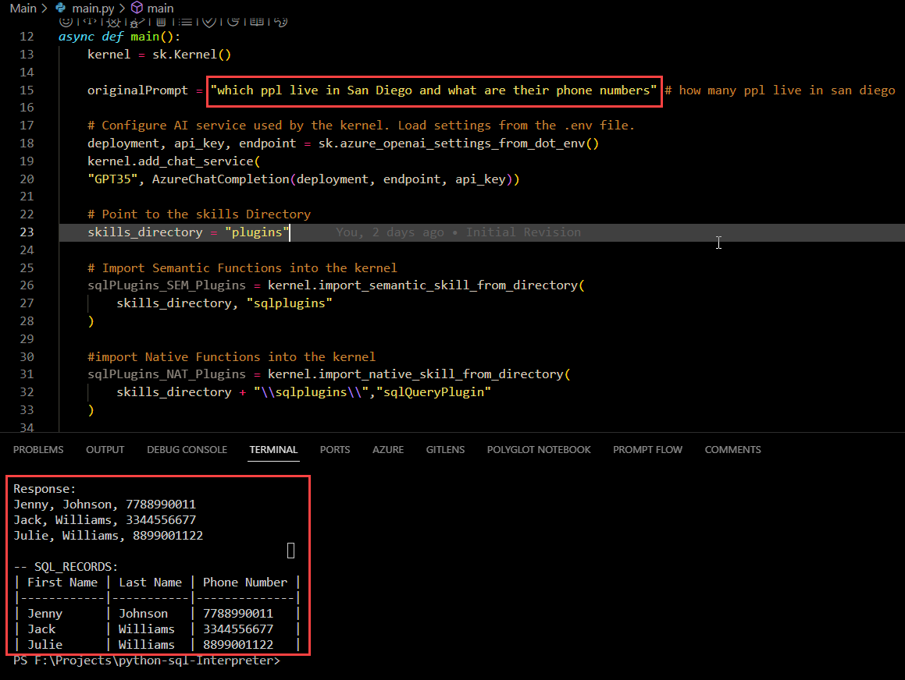

# Semantic Kernel - PYTHON-SQL-INTERPRETER

The `PYTHON-SQL-INTERPRETER` console application demonstrates how to execute a semantic function.

## Prerequisites

- [Python](https://www.python.org/downloads/) 3.8 and above
- [Semantic Kernel Tools](https://marketplace.visualstudio.com/items?itemName=ms-semantic-kernel.semantic-kernel)
- [Semantic Kernel SDK (0.3.14.dev0) - VERSION TESTED](https://pypi.org/project/semantic-kernel/0.3.14.dev0/)

## Configuring the solution

The solution can be configured with a `.env` file in the project which holds api keys and other secrets and configurations.

Make sure you have an
[Azure Open AI service key](https://learn.microsoft.com/azure/cognitive-services/openai/quickstart?pivots=rest-api)

Copy the `.env.example` file to a new file named `.env`. Then, copy those keys into the `.env` file:

```
# OPEN AI Settings
OPENAI_API_KEY=""
OPENAI_ORG_ID=""
AZURE_OPENAI_DEPLOYMENT_NAME=""
AZURE_OPENAI_ENDPOINT=""
AZURE_OPENAI_API_KEY=""

# SQL DB Settings
SERVER_NAME=
DATABASE_NAME=""
SQLADMIN_USER=""
SQL_PASSWORD=""

```

## solution design and sample execution





## Running the solution

To run the console application within Visual Studio Code, just hit `F5`.
As configured in `launch.json` and `tasks.json`, Visual Studio Code will run `python main/main.py`

To build and run the console application from the terminal use the following commands:

```powershell
python main/main.py
```
